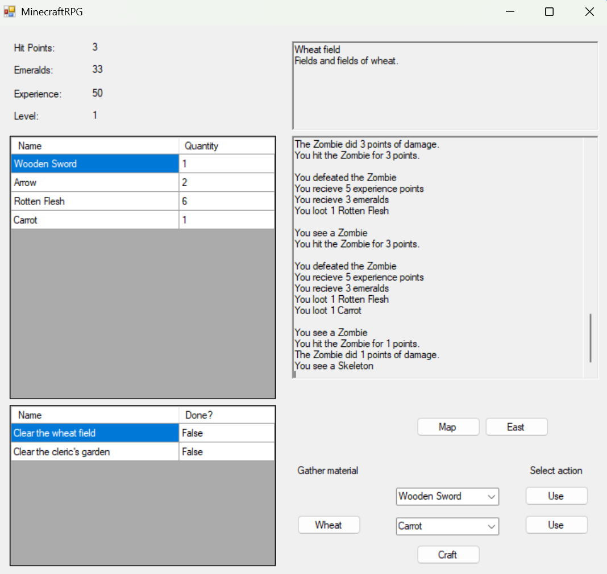
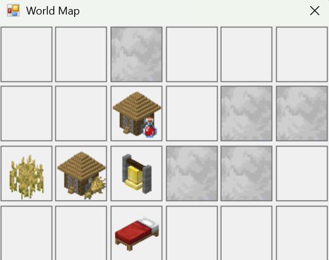
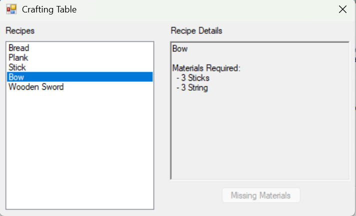

# MinecraftRPG

A text based rpg where you fight mobs, gather resources and craft different items and weapons. Whilst the foundation was built using [Scott Lilly's C# RPG guide](https://scottlilly.com/learn-c-by-building-a-simple-rpg-index/), The features of bow using arrows, more consumables, crafting and resource gathering (and of course the Minecraft reskin) was custom made.

## Screenshots
Main game



Map with some undiscovered locations



Crafting



## Features
- Custom crafting mechanic
- Multiple different consumable types
- Resource gathering
- Bow that uses arrows as ammunition
- A Minecraft theme where everything from mob drops to locations are same as Minecraft

## How to play
To just play the game here are the steps to follow:
1. Navigate to the [Releases](../../releases) tab at the top right of repository
2. Download the zip file of latest release
3. Extract zip file to your computer
4. Run the MinecraftRPG.exe file and play!

## How to build
### Prerequisites
Visual Studio (Not Visual Studio Code)
### Steps
1. Clone this repository to your machine
```bash
git clone https://github.com/RasmusStenlund/MinecraftRPG.git
```
2. Open MinecraftRPG.slnx in Visual Studio
3. Press F5 or Start to run the game in Debug mode
## Credits
Image assets were taken from the [Minecraft Wiki](https://minecraft.wiki/) and from Mojang themselves, and the guide that helped me with building the foundation was made by Scott Lilly and can be found [here](https://scottlilly.com/learn-c-by-building-a-simple-rpg-index/)
